# moony

**Daily spending guidance via SMS** — connects to your bank, calculates how much you can spend today, and texts you every morning.

## Architecture

```mermaid
  flowchart LR
      subgraph Frontend
          A[React] --> B[Plaid Link]
      end

      subgraph Backend
          C[Express API] --> D[Prisma/PostgreSQL]
          E[Scheduler] --> C
      end

      subgraph External
          B --> F[Plaid API]
          C --> F
          C --> G[Twilio SMS/WhatsApp]
          C --> I[Twilio Verify]
          J[Twilio SNS] --> C
      end

      E -->|8am daily| C
      C -->|Send SMS| G
      G -->|SMS/WhatsApp| K[📱 User]
      K -->|Reply| G
      K -->|Reply| J
      G -->|Webhook| C
      J -->|Webhook| C
```




https://github.com/user-attachments/assets/61500fe9-2460-4f7c-a8e5-deaef9e80510

**Key flows:**
1. **Onboarding**: User connects bank via Plaid → verifies phone via Twilio → sets monthly budget via SMS reply
2. **Daily job**: Scheduler fetches transactions → calculates budget → sends SMS
3. **Two-way SMS**: User can update budget anytime by replying with a number

## Tech Stack

| Layer | Tech |
|-------|------|
| **Frontend** | React 19, TypeScript, Vite, Tailwind CSS, Zustand |
| **Backend** | Node.js, Express, TypeScript (ESM) |
| **Database** | PostgreSQL, Prisma ORM |
| **Banking** | Plaid (transactions, account linking) |
| **Messaging** | Twilio |
| **Scheduling** | node-cron |

## Project Structure

```
apps/
├── api/          # Express backend
│   ├── src/
│   │   ├── services/     # Business logic (Plaid, SMS, calculations)
│   │   ├── controllers/  # Route handlers
│   │   └── templates/    # SMS message templates
│   └── prisma/           # Database schema
├── scheduler/    # Cron job runner  
└── web/          # React frontend
```

## Running Locally

```bash
# Install
npm install

# Set up environment (see .env.example)
cp .env.example .env

# Database
npx prisma migrate dev

# Run
npm run dev        # API + scheduler
npm run dev:web    # Frontend (separate terminal)
```

## Documentation

| Doc | Description |
|-----|-------------|
| [`CLAUDE.md`](./CLAUDE.md) | Development standards and patterns |
| [`docs/design_spec.md`](./docs/design_spec.md) | UI design system and tokens |
| [`docs/sms_templates/`](./docs/sms_templates/) | Message template specs |
| [`docs/psychology_of_design_cheatsheet.md`](./docs/psychology_of_design_cheatsheet.md) | UX psychology principles |
| [`apps/web/COMPONENTS.md`](./apps/web/COMPONENTS.md) | Frontend component library |

---

Built as a personal tool to fix my own spending habits. Now used daily.
